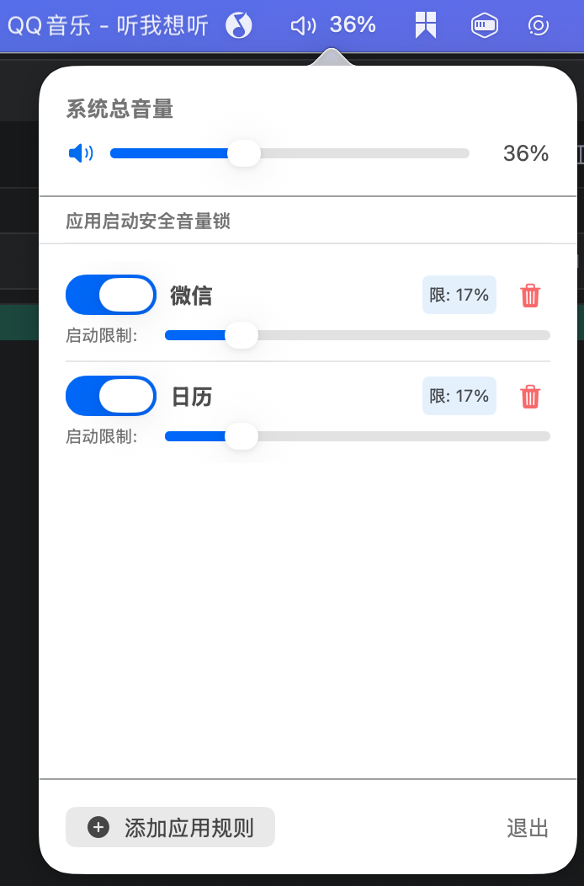

# VolumeController
> 就像手机电量一样, 看不见音量就没有安全感
一款 macOS 菜单栏音量管理工具，旨在保护您的听力，防止应用启动时音量过大。

## ✨ 主要功能

*   **实时音量监控**：在菜单栏实时显示系统音量百分比和动态图标。
*   **应用启动音量锁**：为特定应用（如音乐、视频播放器）设置“安全音量”。当这些应用启动时，如果系统音量超过设定值，会自动降低到安全范围内。
*   **听力保护**：防止意外的高音量对听力造成损害。
*   **低功耗**：使用 CoreAudio API 高效监听系统音量变化，替代传统的轮询方式，几乎不占用 CPU。

## 🛠️ 技术栈

*   **语言**：Swift 5
*   **UI 框架**：SwiftUI
*   **音频底层**：CoreAudio (C API)
*   **系统集成**：AppKit (NSStatusItem, NSPopover)

## 🚀 如何运行

1.  克隆本项目到本地。
2.  使用 Xcode 打开项目文件夹。
3.  确保签名配置正确。
4.  点击运行 (Cmd + R)。

## 📝 使用说明

1.  启动应用后，菜单栏会出现一个音量图标，显示当前音量百分比。
2.  点击图标打开控制面板。
3.  **添加规则**：点击“添加应用规则”，选择正在运行的应用（如 QQ音乐、Spotify）。
4.  **设置限制**：为该应用设置一个启动时的最大安全音量（例如 20%）。
5.  当您下次打开该应用时，如果系统音量高于 20%，软件会自动将其调整为 20% 并发送通知提醒。

## ⚠️ 注意事项

*   本应用需要系统权限以控制音量和监听应用启动状态。
*   应用运行在沙盒之外（因为需要控制全局系统音量和监听其他应用启动）。

## 📄 License

MIT
